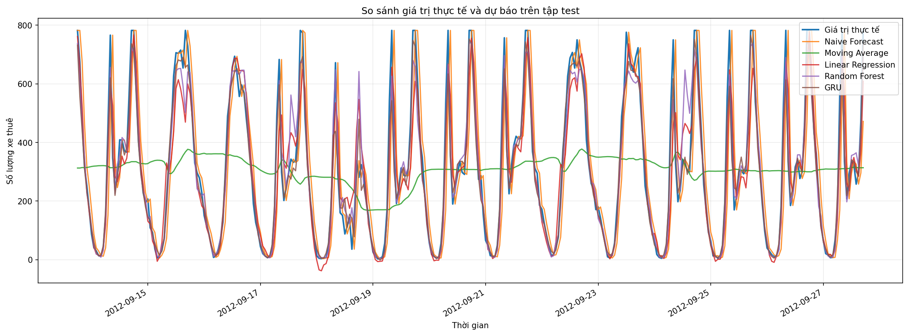
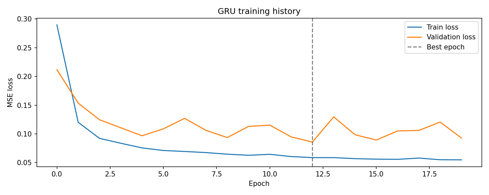

# Time Series Group 06

## 1. Thành Viên Nhóm

| STT | Họ và tên | Phân công chính |
|---:|---|---|
| 1 | Phạm Minh Tuấn | Đọc iTransformer, phân tích dữ liệu |
| 2 | Nguyễn Văn Quang | Đọc TimeMixer, feature engineering |
| 3 | Nguyễn Phan Trung Hiếu | Đọc xLSTM-Mixer, mô hình và đánh giá |

## 2. Chủ Đề Nghiên Cứu

**Dự báo nhu cầu thuê xe đạp theo giờ bằng chuỗi thời gian nhiều chiều**

Nhóm nghiên cứu bài toán dự báo số lượng xe đạp được thuê trong giờ tiếp theo dựa trên nhiều biến đầu vào như thời gian, mùa vụ, thời tiết, nhiệt độ, độ ẩm, tốc độ gió và nhu cầu thuê xe trong quá khứ.

## 3. Mô Tả Bộ Dữ Liệu

Dataset dự kiến sử dụng: **UCI Bike Sharing Dataset**

Link dataset: https://archive.ics.uci.edu/dataset/275/bike+sharing+dataset

File sử dụng: `hour.csv`

Biến mục tiêu:

```text
cnt
```

Một số biến đầu vào:

```text
season, yr, mnth, hr, holiday, weekday, workingday,
weathersit, temp, atemp, hum, windspeed
```

Nhóm không sử dụng `casual` và `registered` làm biến đầu vào vì:

```text
casual + registered = cnt
```

Nếu sử dụng hai biến này, mô hình sẽ bị rò rỉ dữ liệu.

## 4. Feature Engineering (Nguyễn Văn Quang – phụ trách)

Notebook `notebooks/02_feature_engineering.ipynb` thực hiện toàn bộ pipeline:

### 4.1 Các bước xử lý

| Bước | Nội dung |
|------|----------|
| Kiểm tra missing values | `hour.csv` không có missing value trong các cột |
| Kiểm tra sampling | Dữ liệu hourly, có ~165 timestamp bị thiếu; xử lý bằng cách tính lag/rolling theo thứ tự hàng |
| Outlier handling | Winsorization Q1%–Q99% trên `cnt` (giữ nguyên số hàng, không xóa hàng) |
| Time features | `hour`, `day_of_week`, `month`, `is_weekend` |
| Fourier features | `hour_sin/cos` (chu kỳ 24h), `weekday_sin/cos` (7 ngày), `month_sin/cos` (12 tháng) |
| Lag features | `lag_1` (1h trước), `lag_24` (cùng giờ hôm qua), `lag_168` (cùng giờ tuần trước) |
| Rolling features | `rolling_mean_24` (trung bình 24h), `rolling_std_24` (std 24h) |
| Loại bỏ leakage | Xóa `casual`, `registered`, `dteday`, `instant` |
| Train/Val/Test split | 70% / 15% / 15% theo thứ tự thời gian, **không shuffle** |

### 4.2 Chuẩn hóa dữ liệu

**File `data/processed/bike_sharing_processed.csv` lưu giá trị GỐC (chưa chuẩn hóa).**

- `StandardScaler` được thực hiện trong bước huấn luyện mô hình (`03_models.ipynb`) để tránh data leakage.
- Scaler được **fit chỉ trên tập train**, sau đó transform cả train/val/test.

### 4.3 Liên hệ với bài báo TimeMixer

- Fourier features ↔ phân rã mùa vụ đa thang đo (Periodic Decomposition Mixing – PDM)
- `lag_1`, `lag_24`, `lag_168` ↔ đa thang đo lịch sử (multi-scale past mixing)
- `rolling_mean_24` ↔ làm mượt xu hướng trong PDM

## 5. Bài Toán

Dạng bài toán:

```text
Input : X[t-L+1 : t] ∈ R^{L × d}
Output: y[t+h] ∈ R
```

Dự kiến:

```text
L = 24 giờ
h = 1 giờ
y = cnt
```

Nghĩa là mô hình sử dụng dữ liệu của 24 giờ gần nhất để dự báo số lượng xe được thuê trong 1 giờ tiếp theo.

## 6. Ba Bài Báo Đã Đọc

| STT | Bài báo | File tóm tắt |
|---:|---|---|
| 1 | iTransformer: Inverted Transformers Are Effective for Time Series Forecasting | `papers/paper_01_itransformer.md` |
| 2 | TimeMixer: Decomposable Multiscale Mixing for Time Series Forecasting | `papers/paper_02_timemixer.md` |
| 3 | xLSTM-Mixer: Multivariate Time Series Forecasting by Mixing via Scalar Memories | `papers/paper_03_xlstm_mixer.md` |

## 7. Phương Pháp Thực Hiện

Các bước chính:

1. Đọc và tóm tắt 3 bài báo về dự báo chuỗi thời gian nhiều chiều.
2. Thu thập và mô tả dataset.
3. Kiểm tra missing values, outlier và tần suất lấy mẫu.
4. Tạo đặc trưng thời gian, Fourier features, lag features và rolling features.
5. Chuẩn hóa dữ liệu.
6. Chia train/validation/test theo thứ tự thời gian với tỷ lệ 70/15/15.
7. Huấn luyện các mô hình dự báo.
8. Đánh giá mô hình bằng MAE, RMSE và MAPE/sMAPE.
9. Vẽ biểu đồ `y_true` vs `y_pred`.

## 8. Các Mô Hình Sử Dụng

Nhóm đã xây dựng và so sánh 5 mô hình:

| Nhóm mô hình | Mô hình |
|---|---|
| Baseline | Naive Forecast, Moving Average |
| Machine Learning | Linear Regression, Random Forest |
| Deep Learning | GRU |

Trong đó, Naive Forecast và Moving Average đóng vai trò baseline để kiểm tra mức cải thiện của các mô hình học máy/học sâu. Linear Regression là mô hình tuyến tính dễ giải thích. Random Forest sử dụng các đặc trưng thời gian, Fourier, lag và rolling để học quan hệ phi tuyến. GRU sử dụng cửa sổ đầu vào dạng chuỗi thời gian để học quan hệ theo thời gian.

## 9. Kết Quả

Kết quả đánh giá trên tập test:

| Model | MAE | RMSE | MAPE | sMAPE |
|---|---:|---:|---:|---:|
| GRU | 28.39 | 43.98 | 27.69 | 23.94 |
| Random Forest | 34.33 | 57.02 | 23.81 | 20.64 |
| Linear Regression | 57.74 | 85.53 | 79.55 | 43.23 |
| Naive Forecast | 78.21 | 119.47 | 53.37 | 45.41 |
| Moving Average | 156.44 | 197.65 | 557.09 | 78.45 |

Nhận xét nhanh:

- GRU đạt MAE và RMSE thấp nhất, cho thấy dự báo sát hơn theo sai số tuyệt đối.
- Random Forest đạt MAPE và sMAPE thấp nhất, cho thấy mô hình ổn định hơn khi xét sai số tương đối.
- Linear Regression tốt hơn hai baseline theo MAE/RMSE, nhưng kém Random Forest và GRU do quan hệ giữa nhu cầu thuê xe và các biến thời gian/thời tiết có tính phi tuyến.
- GRU, Random Forest và Linear Regression đều cải thiện rõ rệt so với hai baseline.

Kết quả chi tiết được lưu tại:

```text
results/metrics.csv
results/predictions.csv
figures/y_true_vs_y_pred.png
figures/gru_training_curve.png
```

Hình so sánh `y_true` và `y_pred`:



Đường cong huấn luyện GRU:



## 10. Cách Chạy Code

Cài đặt thư viện:

```bash
pip install -r requirements.txt
```

Chạy các notebook theo thứ tự:

```text
notebooks/01_data_exploration.ipynb
notebooks/02_feature_engineering.ipynb
notebooks/03_models.ipynb
notebooks/04_evaluation.ipynb
```

## 11. Quy Trình Làm Việc Trên GitHub

Nhóm làm việc theo branch riêng cho từng thành viên, sau đó tạo Pull Request để review và merge vào `main`.

Tài liệu hướng dẫn chi tiết:

```text
HUONG_DAN_GITHUB.md
```

## 12. Cấu Trúc Repository

```text
time-series-group-06/
├── README.md
├── HUONG_DAN_GITHUB.md
├── papers/
│   ├── paper_01_itransformer.md
│   ├── paper_02_timemixer.md
│   └── paper_03_xlstm_mixer.md
├── data/
│   ├── raw/
│   └── processed/
├── notebooks/
│   ├── 01_data_exploration.ipynb
│   ├── 02_feature_engineering.ipynb
│   ├── 03_models.ipynb
│   └── 04_evaluation.ipynb
├── src/
│   ├── data_loader.py
│   ├── features.py
│   ├── models.py
│   ├── gru.py
│   └── evaluation.py
├── scripts/
│   └── generate_processed_data.py
├── figures/
├── results/
│   ├── metrics.csv
│   └── predictions.csv
├── report/
│   └── final_report.pdf
├── requirements.txt
└── .gitignore
```

## 13. Kết Luận

Đề tài phù hợp với yêu cầu bài tập vì có đầu vào là chuỗi thời gian nhiều chiều và đầu ra là một biến mục tiêu một chiều. Dataset có tính mùa vụ rõ ràng, phù hợp để áp dụng các bước tiền xử lý, tạo đặc trưng và so sánh nhiều mô hình dự báo. Kết quả thực nghiệm cho thấy các mô hình học máy/học sâu cải thiện rõ rệt so với baseline, trong đó GRU tốt nhất theo MAE/RMSE và Random Forest tốt nhất theo MAPE/sMAPE.
