# Báo Cáo Cuối Cùng

## Đề Tài

**Dự báo nhu cầu thuê xe đạp theo giờ bằng chuỗi thời gian nhiều chiều**

**Nhóm:** 06  
**Thành viên:**  

| STT | Họ và tên | Phân công chính |
|---:|---|---|
| 1 | Thành viên 1 | Đọc iTransformer, phân tích dữ liệu khám phá |
| 2 | Thành viên 2 | Đọc TimeMixer, tiền xử lý và tạo đặc trưng |
| 3 | Thành viên 3 | Đọc xLSTM-Mixer, xây dựng mô hình và đánh giá |

> Ghi chú: Trước khi nộp, thay "Thành viên 1/2/3" bằng họ tên thật của nhóm.

---

# Tóm Tắt

Trong các hệ thống chia sẻ xe đạp, nhu cầu thuê xe thay đổi mạnh theo thời gian, thời tiết, ngày trong tuần, giờ cao điểm và các yếu tố mùa vụ. Việc dự báo chính xác nhu cầu thuê xe giúp đơn vị vận hành chuẩn bị số lượng xe phù hợp, tối ưu phân phối xe tại các trạm và giảm tình trạng thiếu hoặc thừa xe cục bộ. Đây là một bài toán chuỗi thời gian nhiều chiều vì dữ liệu đầu vào gồm nhiều biến như giờ, ngày, mùa, nhiệt độ, độ ẩm, tốc độ gió, tình trạng thời tiết và nhu cầu thuê xe trong quá khứ, trong khi biến mục tiêu cần dự báo là một biến một chiều: tổng số xe được thuê (`cnt`).

Nhóm sử dụng bộ dữ liệu **UCI Bike Sharing Dataset**, tập trung vào file `hour.csv` gồm 17,379 quan sát theo giờ trong giai đoạn từ năm 2011 đến năm 2012. Dữ liệu được phân tích, tiền xử lý, tạo đặc trưng thời gian, Fourier, lag và rolling. Sau đó, nhóm xây dựng và so sánh năm mô hình: Naive Forecast, Moving Average, Linear Regression, Random Forest và GRU. Kết quả thực nghiệm cho thấy GRU đạt MAE và RMSE thấp nhất, trong khi Random Forest đạt MAPE và sMAPE thấp nhất. Điều này cho thấy các mô hình học máy và học sâu khai thác tốt hơn cấu trúc đa biến và tính mùa vụ của dữ liệu so với các baseline đơn giản.

**Từ khóa:** multivariate time series, bike sharing demand forecasting, Fourier features, lag features, Random Forest, GRU.

---

# Danh Mục Hình Gợi Ý

| Hình | File nên dùng | Vị trí gợi ý |
|---|---|---|
| Hình 1.1 | `figures/eda_demand_over_time.png` | Chương 1 hoặc 3, minh họa biến động nhu cầu theo thời gian |
| Hình 3.1 | `figures/eda_demand_distribution.png` | Mô tả phân phối biến mục tiêu |
| Hình 3.2 | `figures/eda_demand_by_hour.png` | Phân tích mùa vụ theo giờ |
| Hình 3.3 | `figures/eda_demand_by_weekday.png` | Phân tích khác biệt theo ngày trong tuần |
| Hình 3.4 | `figures/eda_correlation_matrix.png` | Phân tích tương quan biến đầu vào |
| Hình 4.1 | `figures/fe_outlier_boxplot.png` | Xử lý outlier |
| Hình 4.2 | `figures/fe_fourier_features.png` | Minh họa Fourier features |
| Hình 4.3 | `figures/fe_lag_scatter.png` | Minh họa quan hệ giữa lag và `cnt` |
| Hình 4.4 | `figures/fe_train_val_test_split.png` | Chia train/validation/test |
| Hình 6.1 | `figures/gru_training_curve.png` | Quá trình huấn luyện GRU |
| Hình 6.2 | `figures/y_true_vs_y_pred.png` | So sánh giá trị thật và dự báo |

> Ghi chú: Khi chuyển sang Word/PDF, nên dùng các hình trong bảng này. Trong Markdown bên dưới, nhóm đã chèn sẵn một số hình quan trọng nhất.

---

# Danh Mục Bảng Gợi Ý

| Bảng | Nội dung |
|---|---|
| Bảng 3.1 | Mô tả các biến chính trong dataset |
| Bảng 3.2 | Thống kê mô tả biến `cnt` |
| Bảng 4.1 | Các đặc trưng được tạo sau feature engineering |
| Bảng 5.1 | Các mô hình được sử dụng |
| Bảng 6.1 | Kết quả MAE, RMSE, MAPE, sMAPE |
| Bảng 6.2 | Nhận xét điểm mạnh/yếu của từng mô hình |

---

# Chương 1. Tổng Quan Đề Tài

## 1.1 Đặt Vấn Đề

Chuỗi thời gian là dạng dữ liệu trong đó các quan sát được ghi nhận theo thứ tự thời gian. Trong thực tế, nhiều bài toán dự báo không chỉ phụ thuộc vào giá trị quá khứ của biến mục tiêu mà còn chịu ảnh hưởng của nhiều biến khác. Ví dụ, nhu cầu thuê xe đạp không chỉ phụ thuộc vào số xe đã được thuê trong các giờ trước đó, mà còn bị tác động bởi nhiệt độ, độ ẩm, tốc độ gió, tình trạng thời tiết, ngày nghỉ, ngày làm việc, giờ trong ngày và mùa trong năm.

Vì vậy, bài toán dự báo nhu cầu thuê xe đạp là một bài toán **chuỗi thời gian nhiều chiều đầu vào và một chiều đầu ra**. Dữ liệu đầu vào tại mỗi thời điểm gồm nhiều biến giải thích, trong khi đầu ra là số lượng xe được thuê trong một giờ nhất định. Bài toán có thể được biểu diễn như sau:

```text
Input : X[t-L+1 : t] thuộc R^{L x d}
Output: y[t+h] thuộc R
```

Trong đó:

- `L` là độ dài cửa sổ lịch sử.
- `d` là số biến đầu vào.
- `h` là khoảng dự báo.
- `y` là biến mục tiêu `cnt`.

Trong đồ án này, nhóm chọn `L = 24` giờ và `h = 1` giờ. Nghĩa là mô hình sử dụng thông tin của 24 giờ gần nhất để dự báo tổng số xe được thuê trong giờ tiếp theo.

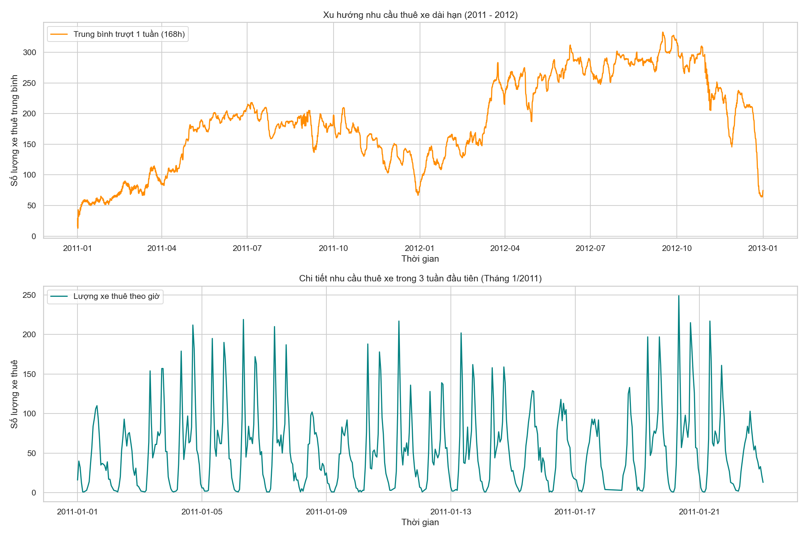

**Hình 1.1.** Biến động nhu cầu thuê xe theo thời gian.  
**Ghi chú chèn hình:** Dùng hình này ở phần đặt vấn đề để cho thấy dữ liệu có xu hướng, dao động và tính mùa vụ rõ ràng.

## 1.2 Lý Do Chọn Đề Tài

Nhóm lựa chọn đề tài dự báo nhu cầu thuê xe đạp theo giờ vì các lý do sau:

1. **Phù hợp với yêu cầu bài tập:** Dữ liệu có nhiều biến đầu vào như thời gian, thời tiết, nhiệt độ, độ ẩm, tốc độ gió và biến mục tiêu một chiều là `cnt`.
2. **Dataset chuẩn và dễ kiểm chứng:** UCI Bike Sharing Dataset là bộ dữ liệu công khai, phổ biến trong các bài toán dự báo và học máy.
3. **Có tính thực tiễn:** Kết quả dự báo có thể hỗ trợ đơn vị vận hành dịch vụ chia sẻ xe đạp trong việc điều phối phương tiện.
4. **Có cấu trúc mùa vụ rõ:** Nhu cầu thuê xe thường thay đổi theo giờ cao điểm, ngày trong tuần, cuối tuần và mùa trong năm.
5. **Phù hợp để so sánh nhiều mô hình:** Bài toán đủ đơn giản để triển khai baseline, nhưng cũng đủ phức tạp để thử nghiệm mô hình học máy và học sâu.

## 1.3 Mục Tiêu Nghiên Cứu

### 1.3.1 Mục tiêu tổng quát

Xây dựng pipeline dự báo số lượng xe đạp được thuê trong giờ tiếp theo dựa trên dữ liệu chuỗi thời gian nhiều chiều, đồng thời so sánh hiệu quả của các mô hình baseline, học máy và học sâu.

### 1.3.2 Mục tiêu cụ thể

Các mục tiêu cụ thể gồm:

- Đọc và tóm tắt ba bài báo mới về dự báo chuỗi thời gian nhiều chiều.
- Phân tích bộ dữ liệu UCI Bike Sharing Dataset.
- Kiểm tra missing values, outlier và tính đều của tần suất lấy mẫu.
- Tạo các đặc trưng thời gian, Fourier, lag và rolling.
- Chia dữ liệu theo thứ tự thời gian thành train/validation/test.
- Huấn luyện và so sánh các mô hình: Naive Forecast, Moving Average, Linear Regression, Random Forest và GRU.
- Đánh giá mô hình bằng MAE, RMSE, MAPE và sMAPE.
- Trực quan hóa kết quả dự báo bằng đồ thị `y_true` và `y_pred`.

## 1.4 Đối Tượng Và Phạm Vi Nghiên Cứu

Đối tượng nghiên cứu là chuỗi thời gian nhu cầu thuê xe đạp theo giờ. Dữ liệu được lấy từ UCI Bike Sharing Dataset, tập trung vào file `hour.csv`. Nhóm không nghiên cứu bài toán dự báo theo trạm riêng lẻ vì dataset hiện tại không chứa thông tin từng trạm. Nhóm cũng không triển khai đầy đủ các mô hình hiện đại như iTransformer, TimeMixer hoặc xLSTM-Mixer do giới hạn thời gian và tài nguyên tính toán, nhưng sử dụng các bài báo này làm cơ sở lý thuyết để thiết kế đặc trưng và lựa chọn mô hình.

## 1.5 Phương Pháp Nghiên Cứu

Nhóm kết hợp phương pháp nghiên cứu lý thuyết và thực nghiệm.

Về lý thuyết, nhóm đọc ba bài báo hiện đại về chuỗi thời gian: iTransformer, TimeMixer và xLSTM-Mixer. Các bài báo này giúp nhóm hiểu rõ hơn về cách khai thác quan hệ giữa các biến, thông tin đa thang đo và phụ thuộc theo thời gian.

Về thực nghiệm, nhóm xây dựng quy trình xử lý dữ liệu theo các bước:

```text
Dữ liệu thô -> EDA -> Tiền xử lý -> Feature engineering
-> Chia train/validation/test -> Huấn luyện mô hình
-> Đánh giá -> So sánh và nhận xét
```

## 1.6 Ý Nghĩa Khoa Học Và Thực Tiễn

Về mặt khoa học, đề tài giúp nhóm vận dụng kiến thức chuỗi thời gian nhiều chiều, feature engineering và mô hình dự báo. Việc so sánh nhiều mô hình cho phép nhóm thấy rõ vai trò của baseline, mô hình tuyến tính, mô hình phi tuyến và mô hình tuần tự.

Về mặt thực tiễn, bài toán dự báo nhu cầu thuê xe có thể hỗ trợ điều phối xe, tối ưu vận hành và cải thiện trải nghiệm người dùng trong các hệ thống chia sẻ xe đạp.

---

# Chương 2. Cơ Sở Lý Thuyết Và Các Bài Báo Liên Quan

## 2.1 Chuỗi Thời Gian Nhiều Chiều

Chuỗi thời gian nhiều chiều là chuỗi dữ liệu được quan sát theo thời gian với nhiều biến tại mỗi thời điểm. Nếu tại thời điểm `t`, hệ thống có `d` biến đầu vào, ta có vector:

```text
X_t = [x_{t,1}, x_{t,2}, ..., x_{t,d}]
```

Bài toán của nhóm sử dụng một cửa sổ lịch sử gồm `L` bước thời gian:

```text
X[t-L+1:t] thuộc R^{L x d}
```

Mục tiêu là dự báo:

```text
y[t+h] = cnt[t+h]
```

Trong đó `cnt` là tổng số xe đạp được thuê.

## 2.2 Các Đặc Trưng Thời Gian Và Mùa Vụ

Dữ liệu thuê xe đạp có tính mùa vụ rõ ràng. Nhu cầu có thể tăng vào giờ đi làm, giờ tan tầm, khác nhau giữa ngày thường và cuối tuần, đồng thời thay đổi theo tháng và mùa. Vì vậy, nhóm tạo thêm các biến:

- `hour`: giờ trong ngày.
- `day_of_week`: ngày trong tuần.
- `month`: tháng.
- `is_weekend`: đánh dấu cuối tuần.
- Fourier features cho chu kỳ ngày, tuần và năm.
- Lag features cho các mốc 1 giờ, 24 giờ và 168 giờ trước.
- Rolling features cho trung bình và độ lệch chuẩn 24 giờ.

## 2.3 Các Độ Đo Đánh Giá

Nhóm sử dụng bốn chỉ số đánh giá:

**MAE - Mean Absolute Error**

```text
MAE = mean(|y_true - y_pred|)
```

MAE đo sai số tuyệt đối trung bình, dễ diễn giải vì cùng đơn vị với biến mục tiêu.

**RMSE - Root Mean Squared Error**

```text
RMSE = sqrt(mean((y_true - y_pred)^2))
```

RMSE phạt nặng các sai số lớn, phù hợp để đánh giá mô hình khi các dự báo lệch nhiều là điều cần tránh.

**MAPE - Mean Absolute Percentage Error**

```text
MAPE = mean(|(y_true - y_pred) / y_true|) * 100%
```

MAPE biểu diễn sai số theo phần trăm. Tuy nhiên, chỉ số này dễ bị tăng rất mạnh khi `y_true` nhỏ.

**sMAPE - Symmetric MAPE**

```text
sMAPE = mean(2 * |y_true - y_pred| / (|y_true| + |y_pred|)) * 100%
```

sMAPE ổn định hơn MAPE trong một số trường hợp vì xét cả độ lớn của giá trị thật và giá trị dự báo.

## 2.4 Bài Báo 1: iTransformer

Bài báo **iTransformer: Inverted Transformers Are Effective for Time Series Forecasting** đề xuất cách đảo ngược cách biểu diễn dữ liệu trong Transformer cho chuỗi thời gian nhiều chiều. Thay vì xem mỗi thời điểm là một token, iTransformer xem toàn bộ chuỗi lịch sử của mỗi biến là một token. Cách làm này giúp attention tập trung vào quan hệ giữa các biến.

Ý tưởng này liên quan trực tiếp đến bài toán của nhóm vì nhu cầu thuê xe chịu ảnh hưởng đồng thời từ nhiều biến như nhiệt độ, độ ẩm, gió, thời tiết, giờ và ngày trong tuần. Dù nhóm chưa triển khai iTransformer, bài báo giúp nhóm nhấn mạnh việc phân tích tương quan giữa các biến và tránh xử lý dữ liệu đa biến như một tập biến độc lập rời rạc.

## 2.5 Bài Báo 2: TimeMixer

Bài báo **TimeMixer: Decomposable Multiscale Mixing for Time Series Forecasting** tập trung vào việc khai thác thông tin đa thang đo trong chuỗi thời gian. TimeMixer phân tích chuỗi thành các thành phần xu hướng và mùa vụ ở nhiều độ phân giải khác nhau, sau đó trộn thông tin từ thang mịn đến thang thô và ngược lại.

Ý tưởng này được nhóm vận dụng khi tạo:

- Fourier features cho chu kỳ giờ, ngày trong tuần và tháng.
- `lag_1`, `lag_24`, `lag_168` để biểu diễn thông tin ở thang 1 giờ, 1 ngày và 1 tuần.
- `rolling_mean_24`, `rolling_std_24` để biểu diễn xu hướng và độ biến động ngắn hạn.

## 2.6 Bài Báo 3: xLSTM-Mixer

Bài báo **xLSTM-Mixer: Multivariate Time Series Forecasting by Mixing via Scalar Memories** kết hợp mô hình tuyến tính, mixing và xLSTM để học cả phụ thuộc theo thời gian và quan hệ giữa các biến. Mô hình này phù hợp với dự báo chuỗi thời gian nhiều chiều nhưng có kiến trúc phức tạp hơn GRU hoặc LSTM cơ bản.

Trong phạm vi đồ án, nhóm chưa triển khai xLSTM-Mixer nguyên bản. Tuy nhiên, bài báo giúp nhóm củng cố lựa chọn dùng input window nhiều chiều và GRU để học thông tin tuần tự. GRU được xem như mô hình học sâu khả thi trong thời gian thực hiện bài tập.

## 2.7 Tổng Kết Chương

Ba bài báo trên cung cấp ba góc nhìn quan trọng:

- iTransformer nhấn mạnh quan hệ giữa các biến.
- TimeMixer nhấn mạnh thông tin đa thang đo và mùa vụ.
- xLSTM-Mixer nhấn mạnh kết hợp thông tin theo thời gian và giữa các biến.

Các ý tưởng này được nhóm chuyển hóa thành các bước thực nghiệm cụ thể: phân tích tương quan, tạo Fourier features, tạo lag/rolling features, dùng input window 24 giờ và so sánh mô hình tuần tự GRU với các mô hình đơn giản hơn.

---

# Chương 3. Dữ Liệu Và Phân Tích Khám Phá

## 3.1 Nguồn Dữ Liệu

Nhóm sử dụng **UCI Bike Sharing Dataset**. Bộ dữ liệu ghi nhận số lượng xe đạp được thuê theo giờ trong hệ thống Capital Bikeshare, cùng với các biến thời tiết và lịch.

File chính được sử dụng là:

```text
data/raw/hour.csv
```

Thông tin tổng quan:

| Thuộc tính | Giá trị |
|---|---:|
| Số dòng dữ liệu thô | 17,379 |
| Số cột dữ liệu thô | 17 |
| Thời gian bắt đầu | 2011-01-01 |
| Thời gian kết thúc | 2012-12-31 |
| Biến mục tiêu | `cnt` |
| Đơn vị thời gian | Theo giờ |

## 3.2 Mô Tả Biến

Một số biến quan trọng trong dữ liệu:

| Biến | Ý nghĩa |
|---|---|
| `season` | Mùa trong năm |
| `yr` | Năm |
| `mnth` | Tháng |
| `hr` | Giờ trong ngày |
| `holiday` | Có phải ngày nghỉ hay không |
| `weekday` | Ngày trong tuần |
| `workingday` | Có phải ngày làm việc hay không |
| `weathersit` | Tình trạng thời tiết |
| `temp` | Nhiệt độ chuẩn hóa |
| `atemp` | Nhiệt độ cảm nhận chuẩn hóa |
| `hum` | Độ ẩm |
| `windspeed` | Tốc độ gió |
| `casual` | Số lượt thuê của người dùng casual |
| `registered` | Số lượt thuê của người dùng registered |
| `cnt` | Tổng số lượt thuê xe |

Nhóm không sử dụng `casual` và `registered` làm biến đầu vào vì:

```text
casual + registered = cnt
```

Nếu đưa hai biến này vào mô hình, mô hình sẽ gần như biết trước kết quả cần dự báo. Đây là lỗi **data leakage**, làm kết quả đánh giá không còn đáng tin cậy.

## 3.3 Thống Kê Mô Tả Biến Mục Tiêu

Thống kê của biến `cnt` trên dữ liệu thô:

| Chỉ số | Giá trị |
|---|---:|
| Count | 17,379 |
| Mean | 189.46 |
| Std | 181.39 |
| Min | 1 |
| Q1 | 40 |
| Median | 142 |
| Q3 | 281 |
| Max | 977 |

Biến `cnt` có độ biến động lớn. Giá trị nhỏ nhất là 1, trong khi giá trị lớn nhất lên tới 977. Điều này cho thấy nhu cầu thuê xe thay đổi rất mạnh giữa các thời điểm thấp điểm và cao điểm.

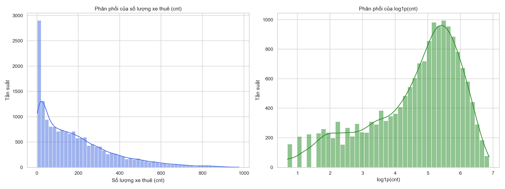

**Hình 3.1.** Phân phối số lượng xe được thuê theo giờ.  
**Ghi chú chèn hình:** Dùng hình này để giải thích tại sao MAE/RMSE và MAPE có thể phản ánh các khía cạnh khác nhau của sai số.

## 3.4 Phân Tích Theo Giờ

Nhu cầu thuê xe có tính chu kỳ theo giờ rất rõ. Trong ngày, nhu cầu thường tăng ở các khung giờ đi làm và tan tầm. Đây là đặc điểm quan trọng của bài toán vì nó cho thấy biến `hour` và các đặc trưng chu kỳ theo giờ có khả năng đóng góp đáng kể cho mô hình.

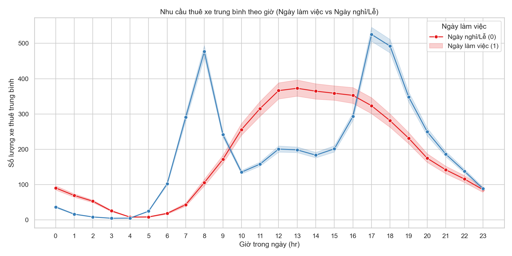

**Hình 3.2.** Nhu cầu thuê xe trung bình theo giờ trong ngày.  
**Ghi chú chèn hình:** Đây là hình nên đưa vào báo cáo vì thể hiện rõ mùa vụ 24 giờ.

## 3.5 Phân Tích Theo Ngày Trong Tuần Và Mùa

Nhu cầu thuê xe cũng thay đổi theo ngày trong tuần. Ngày làm việc và cuối tuần có hành vi sử dụng khác nhau. Ngoài ra, mùa trong năm cũng ảnh hưởng đến nhu cầu do liên quan tới thời tiết, nhiệt độ và thói quen di chuyển.

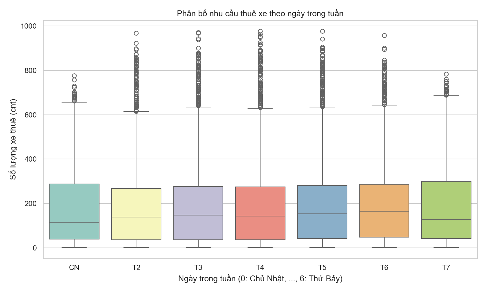

**Hình 3.3.** Nhu cầu thuê xe theo ngày trong tuần.  
**Ghi chú chèn hình:** Dùng hình này khi giải thích biến `day_of_week` và `is_weekend`.

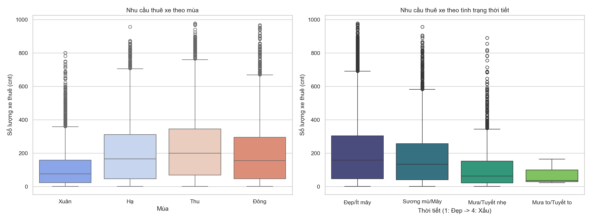

**Hình 3.4.** Nhu cầu thuê xe theo mùa.  
**Ghi chú chèn hình:** Có thể dùng nếu báo cáo cần làm rõ tác động của mùa vụ trong năm.

## 3.6 Phân Tích Tương Quan

Ma trận tương quan được sử dụng để xem xét quan hệ tuyến tính giữa các biến. Kết quả EDA cho thấy các biến thời gian, nhiệt độ, thời tiết và các biến liên quan đến nhu cầu quá khứ đều có ý nghĩa trong dự báo `cnt`. Tuy nhiên, tương quan tuyến tính chỉ phản ánh một phần quan hệ, do đó nhóm tiếp tục sử dụng Random Forest và GRU để học các quan hệ phi tuyến và phụ thuộc theo thời gian.

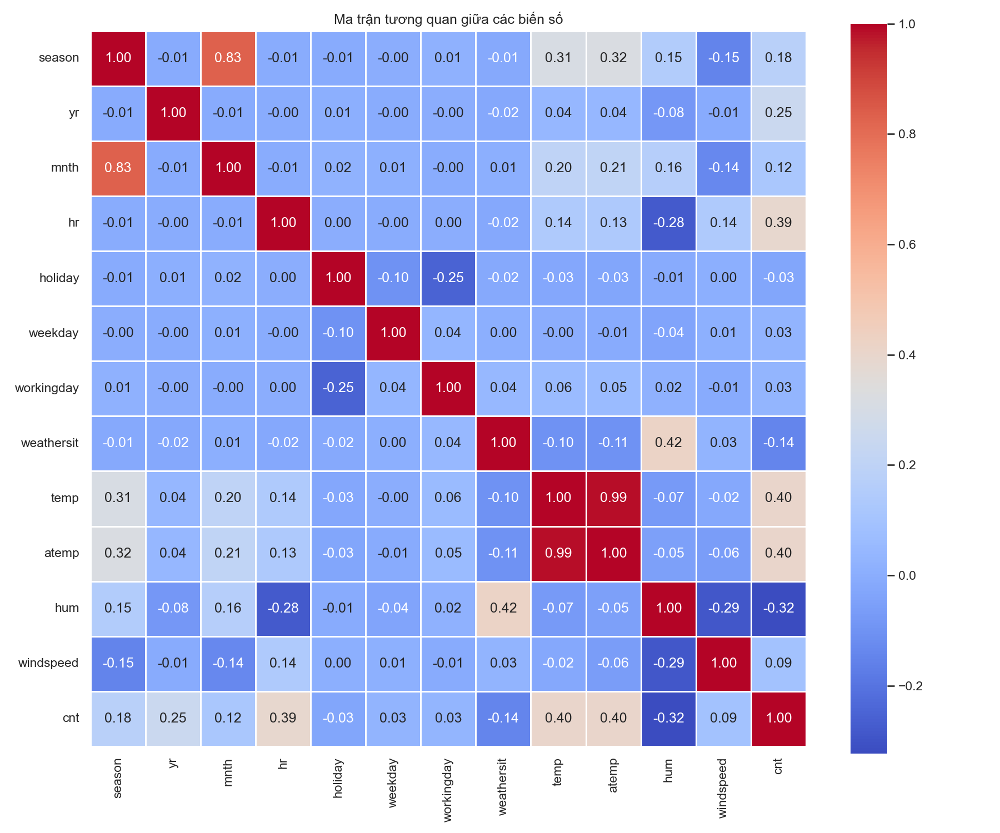

**Hình 3.5.** Ma trận tương quan giữa các biến.  
**Ghi chú chèn hình:** Nên dùng hình này để liên hệ với iTransformer: bài toán cần học quan hệ giữa nhiều biến.

## 3.7 Kiểm Tra Missing Values Và Tần Suất Lấy Mẫu

Dữ liệu thô không có missing values trong các cột. Tuy nhiên, khi kiểm tra theo timeline hourly liên tục, dữ liệu có khoảng 165 timestamp bị thiếu. Điều này cho thấy dữ liệu không hoàn toàn đều tuyệt đối theo từng giờ.

Trong phạm vi đồ án, nhóm không nội suy lại toàn bộ timeline bị thiếu. Thay vào đó, nhóm xử lý theo thứ tự thời gian có sẵn và tạo lag/rolling features bằng `shift`, sau đó loại bỏ các dòng không đủ lịch sử do quá trình tạo lag.

## 3.8 Tổng Kết Chương

Qua phân tích khám phá, nhóm nhận thấy dữ liệu có:

- Tính mùa vụ theo giờ trong ngày.
- Khác biệt giữa ngày trong tuần và cuối tuần.
- Ảnh hưởng của mùa, thời tiết, nhiệt độ và độ ẩm.
- Phân phối biến mục tiêu lệch và biến động mạnh.
- Tính chất đa biến rõ ràng, phù hợp với yêu cầu của bài tập.

Những phát hiện này là cơ sở để nhóm thiết kế bước tiền xử lý và tạo đặc trưng trong chương tiếp theo.

---

# Chương 4. Tiền Xử Lý Và Tạo Đặc Trưng

## 4.1 Mục Tiêu Tiền Xử Lý

Mục tiêu của bước tiền xử lý là biến dữ liệu thô thành dữ liệu phù hợp cho mô hình dự báo. Các yêu cầu chính gồm:

- Kiểm tra missing values.
- Kiểm tra tần suất lấy mẫu.
- Xử lý outlier.
- Tạo biến thời gian.
- Tạo Fourier features.
- Tạo lag và rolling features.
- Loại bỏ cột gây leakage.
- Chia train/validation/test theo thứ tự thời gian.
- Chuẩn hóa dữ liệu trong quá trình huấn luyện.

## 4.2 Xử Lý Outlier

Do biến `cnt` có giá trị dao động mạnh, nhóm sử dụng Winsorization theo ngưỡng Q1% và Q99%. Thay vì xóa các dòng outlier, nhóm clip giá trị về khoảng hợp lý để giữ tính liên tục của chuỗi thời gian.

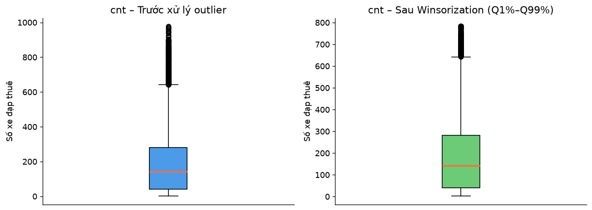

**Hình 4.1.** Boxplot trước và sau xử lý outlier.  
**Ghi chú chèn hình:** Dùng hình này để chứng minh nhóm có thực hiện xử lý outlier theo yêu cầu.

## 4.3 Tạo Biến Thời Gian

Từ cột ngày và giờ, nhóm tạo cột `datetime`, sau đó tạo các biến:

| Biến mới | Ý nghĩa |
|---|---|
| `hour` | Giờ trong ngày |
| `day_of_week` | Ngày trong tuần |
| `month` | Tháng |
| `is_weekend` | Đánh dấu cuối tuần |

Các biến này giúp mô hình học được quy luật hành vi theo lịch.

## 4.4 Fourier Features

Các biến như giờ, ngày trong tuần và tháng có tính chu kỳ. Nếu dùng trực tiếp giá trị số, mô hình có thể hiểu sai rằng giờ 23 và giờ 0 cách xa nhau, trong khi thực tế hai thời điểm này gần nhau trong chu kỳ ngày. Vì vậy, nhóm tạo Fourier features dạng sin/cos:

```text
hour_sin = sin(2*pi*hour/24)
hour_cos = cos(2*pi*hour/24)
weekday_sin = sin(2*pi*day_of_week/7)
weekday_cos = cos(2*pi*day_of_week/7)
month_sin = sin(2*pi*month/12)
month_cos = cos(2*pi*month/12)
```

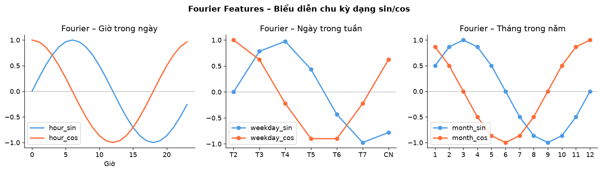

**Hình 4.2.** Biểu diễn chu kỳ bằng Fourier features.  
**Ghi chú chèn hình:** Dùng hình này để liên hệ với TimeMixer và tính mùa vụ đa thang đo.

## 4.5 Lag Và Rolling Features

Để đưa thông tin quá khứ vào mô hình, nhóm tạo các lag features:

| Feature | Ý nghĩa |
|---|---|
| `lag_1` | Nhu cầu thuê xe 1 giờ trước |
| `lag_24` | Nhu cầu cùng giờ ngày hôm trước |
| `lag_168` | Nhu cầu cùng giờ tuần trước |

Ngoài ra, nhóm tạo rolling features:

| Feature | Ý nghĩa |
|---|---|
| `rolling_mean_24` | Trung bình nhu cầu trong 24 giờ trước |
| `rolling_std_24` | Độ lệch chuẩn nhu cầu trong 24 giờ trước |

Các feature này đều được tạo bằng `shift` để tránh sử dụng thông tin tương lai.

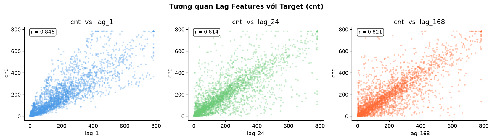

**Hình 4.3.** Quan hệ giữa lag features và biến mục tiêu.  
**Ghi chú chèn hình:** Dùng hình này để giải thích vì sao lag features quan trọng cho bài toán dự báo.

## 4.6 Loại Bỏ Data Leakage

Nhóm loại bỏ các cột:

```text
casual, registered, dteday, instant
```

Trong đó `casual` và `registered` đặc biệt nguy hiểm vì tổng của chúng bằng `cnt`. Nếu sử dụng hai biến này làm input, mô hình sẽ đánh giá tốt giả tạo nhưng không có giá trị dự báo thực tế.

## 4.7 Chia Train/Validation/Test

Với chuỗi thời gian, dữ liệu phải được chia theo thứ tự thời gian, không shuffle. Nhóm chia dữ liệu theo tỷ lệ 70/15/15:

| Tập dữ liệu | Số dòng |
|---|---:|
| Train | 12,047 |
| Validation | 2,582 |
| Test | 2,582 |

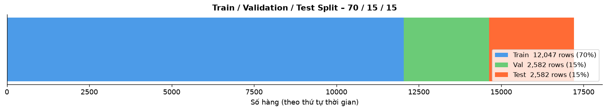

**Hình 4.4.** Chia dữ liệu theo thứ tự thời gian.  
**Ghi chú chèn hình:** Đây là hình nên có trong báo cáo để chứng minh nhóm chia dữ liệu đúng nguyên tắc chuỗi thời gian.

## 4.8 Chuẩn Hóa Dữ Liệu

File processed được lưu ở dạng giá trị gốc để dễ kiểm tra. Trong bước huấn luyện, nhóm dùng `StandardScaler` và chỉ fit scaler trên tập train, sau đó transform validation và test. Cách làm này giúp tránh leakage từ validation/test vào train.

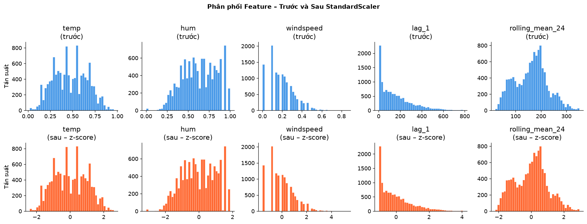

**Hình 4.5.** Phân phối một số feature trước và sau chuẩn hóa.  
**Ghi chú chèn hình:** Hình này có thể dùng nếu báo cáo cần minh họa bước chuẩn hóa; nếu muốn báo cáo gọn, có thể bỏ hình này.

## 4.9 Kết Quả Dữ Liệu Sau Xử Lý

Sau tiền xử lý, file processed có:

| Thuộc tính | Giá trị |
|---|---:|
| Số dòng | 17,211 |
| Số cột | 30 |
| File | `data/processed/bike_sharing_processed.csv` |

Các nhóm feature chính gồm:

- Biến gốc hợp lệ: `season`, `yr`, `mnth`, `hr`, `holiday`, `weekday`, `workingday`, `weathersit`, `temp`, `atemp`, `hum`, `windspeed`.
- Biến thời gian mới: `hour`, `day_of_week`, `month`, `is_weekend`.
- Fourier features: `hour_sin`, `hour_cos`, `weekday_sin`, `weekday_cos`, `month_sin`, `month_cos`.
- Lag features: `lag_1`, `lag_24`, `lag_168`.
- Rolling features: `rolling_mean_24`, `rolling_std_24`.
- Cột `split`: train/val/test.

## 4.10 Tổng Kết Chương

Sau bước tiền xử lý, dữ liệu đã sẵn sàng cho huấn luyện mô hình. Nhóm đã xử lý đầy đủ các yêu cầu quan trọng của bài tập: missing values, sampling, outlier, biến thời gian, Fourier, chuẩn hóa và chia dữ liệu theo thứ tự thời gian.

---

# Chương 5. Xây Dựng Mô Hình

## 5.1 Thiết Lập Bài Toán Dự Báo

Nhóm thiết lập bài toán dự báo một bước trước:

```text
Input window : X[t-23 : t] thuộc R^{24 x d}
Output       : y[t+1] = cnt[t+1]
```

Với các mô hình tabular như Linear Regression và Random Forest, nhóm sử dụng các feature đã được tạo trong file processed. Với GRU, nhóm tạo các cửa sổ chuỗi có độ dài 24 giờ.

## 5.2 Các Mô Hình Sử Dụng

Nhóm sử dụng 5 mô hình:

| Nhóm | Mô hình | Vai trò |
|---|---|---|
| Baseline | Naive Forecast | Dự báo bằng giá trị gần nhất |
| Baseline | Moving Average | Dự báo bằng trung bình trượt 24 giờ |
| Machine Learning | Linear Regression | Baseline tuyến tính dễ giải thích |
| Machine Learning | Random Forest | Mô hình phi tuyến dựa trên cây |
| Deep Learning | GRU | Mô hình tuần tự học phụ thuộc theo thời gian |

## 5.3 Naive Forecast

Naive Forecast giả định giá trị ở thời điểm tiếp theo gần bằng giá trị quan sát gần nhất. Đây là baseline đơn giản nhưng quan trọng vì nếu mô hình phức tạp không vượt qua được Naive Forecast thì mô hình đó chưa thực sự hữu ích.

```text
y_pred[t] = y_true[t-1]
```

## 5.4 Moving Average

Moving Average sử dụng trung bình của 24 giờ trước để dự báo. Mô hình này làm mượt dao động ngắn hạn, nhưng có thể phản ứng chậm với các thay đổi đột ngột trong nhu cầu thuê xe.

```text
y_pred[t] = mean(y_true[t-24], ..., y_true[t-1])
```

## 5.5 Linear Regression

Linear Regression học quan hệ tuyến tính giữa các biến đầu vào và `cnt`. Đây là mô hình đơn giản, dễ diễn giải và thường được dùng làm baseline mạnh hơn so với Naive Forecast hoặc Moving Average. Tuy nhiên, bài toán thuê xe có nhiều quan hệ phi tuyến, nên Linear Regression có thể bị hạn chế.

## 5.6 Random Forest

Random Forest là mô hình ensemble gồm nhiều cây quyết định. Mô hình này có khả năng học quan hệ phi tuyến và tương tác giữa các biến mà không cần giả định quan hệ tuyến tính. Random Forest phù hợp với bộ feature engineering của nhóm, đặc biệt là các biến thời gian, Fourier, lag và rolling.

## 5.7 GRU

GRU (Gated Recurrent Unit) là một biến thể của RNN, được thiết kế để học phụ thuộc theo thời gian tốt hơn RNN cơ bản. GRU sử dụng các cổng để kiểm soát thông tin cần giữ lại hoặc quên đi, giúp mô hình học được các mẫu tuần tự trong chuỗi thời gian.

Trong đồ án này, GRU nhận input là cửa sổ 24 giờ gồm nhiều biến. Mô hình được huấn luyện với tập train, theo dõi validation loss và sử dụng early stopping để hạn chế overfitting.


**Hình 5.1.** Quá trình huấn luyện GRU.  
**Ghi chú chèn hình:** Nên dùng hình này ở phần mô hình hoặc kết quả để chứng minh mô hình học sâu đã được huấn luyện thật.

## 5.8 Tổng Kết Chương

Các mô hình được lựa chọn theo ba mức độ phức tạp: baseline đơn giản, mô hình học máy và mô hình học sâu. Cách lựa chọn này giúp nhóm đánh giá được mức cải thiện khi tăng độ phức tạp mô hình.

---

# Chương 6. Kết Quả Thực Nghiệm Và Đánh Giá

## 6.1 Thiết Lập Đánh Giá

Các mô hình được đánh giá trên tập test. Nhóm sử dụng các chỉ số:

- MAE
- RMSE
- MAPE
- sMAPE

Kết quả được lưu tại:

```text
results/metrics.csv
results/predictions.csv
```

## 6.2 Bảng Kết Quả

| Model | MAE | RMSE | MAPE | sMAPE |
|---|---:|---:|---:|---:|
| GRU | 28.39 | 43.98 | 27.69 | 23.94 |
| Random Forest | 34.33 | 57.02 | 23.81 | 20.64 |
| Linear Regression | 57.74 | 85.53 | 79.55 | 43.23 |
| Naive Forecast | 78.21 | 119.47 | 53.37 | 45.41 |
| Moving Average | 156.44 | 197.65 | 557.09 | 78.45 |

## 6.3 Phân Tích Kết Quả

Kết quả cho thấy GRU đạt MAE và RMSE thấp nhất. Điều này có nghĩa là xét theo sai số tuyệt đối, GRU dự báo gần giá trị thực hơn các mô hình còn lại. Đây là kết quả hợp lý vì GRU có khả năng học phụ thuộc theo thời gian từ cửa sổ 24 giờ.

Random Forest đạt MAPE và sMAPE thấp nhất. Điều này cho thấy khi xét sai số tương đối, Random Forest có độ ổn định tốt. Mô hình này khai thác hiệu quả các feature đã tạo, đặc biệt là lag, rolling và Fourier features.

Linear Regression tốt hơn hai baseline theo MAE và RMSE, nhưng kém Random Forest và GRU. Điều này cho thấy các đặc trưng đầu vào có thông tin hữu ích, nhưng quan hệ giữa nhu cầu thuê xe và các biến đầu vào không hoàn toàn tuyến tính.

Naive Forecast và Moving Average có kết quả kém hơn. Moving Average đặc biệt có MAPE rất cao vì khi giá trị thật nhỏ, sai số phần trăm dễ bị phóng đại. Đây là hạn chế thường gặp của MAPE trong dữ liệu có nhiều giá trị nhỏ.


**Hình 6.1.** So sánh `y_true` và `y_pred` trên tập test.  
**Ghi chú chèn hình:** Đây là hình quan trọng nhất phần kết quả, nên đưa vào báo cáo và slide thuyết trình.

## 6.4 So Sánh Các Mô Hình

| Mô hình | Điểm mạnh | Hạn chế |
|---|---|---|
| Naive Forecast | Rất đơn giản, dễ làm baseline | Không học được mùa vụ và biến ngoài |
| Moving Average | Làm mượt dao động ngắn hạn | Phản ứng chậm, kém khi dữ liệu biến động mạnh |
| Linear Regression | Dễ giải thích, chạy nhanh | Giả định quan hệ tuyến tính |
| Random Forest | Học được quan hệ phi tuyến, tận dụng feature engineering tốt | Không trực tiếp học chuỗi theo dạng sequence |
| GRU | Học được phụ thuộc theo thời gian, MAE/RMSE tốt nhất | Huấn luyện lâu hơn, khó giải thích hơn |

## 6.5 Liên Hệ Với Ba Bài Báo

Kết quả thực nghiệm của nhóm có thể liên hệ với ba bài báo như sau:

- Với iTransformer, bài toán cho thấy quan hệ giữa các biến là quan trọng. Random Forest và GRU đều sử dụng nhiều biến đầu vào thay vì chỉ dùng chuỗi `cnt`.
- Với TimeMixer, các Fourier, lag và rolling features phản ánh tinh thần khai thác thông tin đa thang đo. Kết quả tốt của Random Forest cho thấy feature engineering đa thang đo có giá trị.
- Với xLSTM-Mixer, kết quả của GRU cho thấy mô hình tuần tự có lợi thế trong việc học phụ thuộc theo thời gian, dù nhóm chưa triển khai kiến trúc xLSTM-Mixer đầy đủ.

## 6.6 Thảo Luận

Từ kết quả trên, nhóm rút ra một số nhận xét:

1. Feature engineering đóng vai trò quan trọng. Các đặc trưng thời gian, Fourier, lag và rolling giúp mô hình học được mùa vụ và thông tin quá khứ.
2. Mô hình phi tuyến Random Forest tốt hơn Linear Regression ở hầu hết các chỉ số, cho thấy quan hệ trong dữ liệu không chỉ tuyến tính.
3. GRU đạt MAE/RMSE thấp nhất, phù hợp với đặc thù chuỗi thời gian.
4. MAPE cần được diễn giải cẩn thận do dữ liệu có các thời điểm `cnt` nhỏ.
5. Việc chia dữ liệu theo thời gian và tránh data leakage là yếu tố quan trọng để kết quả đáng tin cậy.

## 6.7 Tổng Kết Chương

Các kết quả thực nghiệm cho thấy nhóm đã xây dựng được pipeline dự báo hoàn chỉnh. GRU và Random Forest là hai mô hình có kết quả tốt nhất, trong đó GRU tốt nhất theo sai số tuyệt đối còn Random Forest tốt nhất theo sai số tương đối.

---

# Chương 7. Quy Trình Làm Việc Trên GitHub

## 7.1 Cấu Trúc Repository

Repository của nhóm được tổ chức theo cấu trúc:

```text
time-series-group-06/
├── README.md
├── HUONG_DAN_GITHUB.md
├── papers/
├── data/
├── notebooks/
├── src/
├── scripts/
├── figures/
├── results/
├── report/
├── requirements.txt
└── .gitignore
```

## 7.2 Phân Công Theo Thành Viên

| Thành viên | Nội dung chính | Branch/File liên quan |
|---|---|---|
| Thành viên 1 | Paper iTransformer, EDA | `papers/paper_01_itransformer.md`, `notebooks/01_data_exploration.ipynb` |
| Thành viên 2 | Paper TimeMixer, feature engineering | `papers/paper_02_timemixer.md`, `notebooks/02_feature_engineering.ipynb`, `src/features.py` |
| Thành viên 3 | Paper xLSTM-Mixer, mô hình, đánh giá | `papers/paper_03_xlstm_mixer.md`, `notebooks/03_models.ipynb`, `notebooks/04_evaluation.ipynb` |

## 7.3 Quy Trình Branch Và Pull Request

Nhóm sử dụng quy trình:

```text
main -> feature branch -> commit -> push -> pull request -> review -> merge
```

Cách làm này giúp:

- Tránh ghi đè công việc của nhau.
- Dễ kiểm tra phần đóng góp của từng thành viên.
- Giữ branch `main` ổn định.
- Tăng tính chuyên nghiệp của sản phẩm nộp.

Tài liệu hướng dẫn chi tiết được lưu tại:

```text
HUONG_DAN_GITHUB.md
```

---

# Chương 8. Kết Luận Và Hướng Phát Triển

## 8.1 Kết Luận

Trong đồ án này, nhóm đã xây dựng một pipeline dự báo nhu cầu thuê xe đạp theo giờ bằng dữ liệu chuỗi thời gian nhiều chiều. Dữ liệu đầu vào gồm nhiều biến thời gian, thời tiết và nhu cầu trong quá khứ; đầu ra là biến mục tiêu `cnt`.

Nhóm đã hoàn thành các nội dung chính:

- Đọc và tóm tắt ba bài báo mới về chuỗi thời gian.
- Phân tích dữ liệu Bike Sharing.
- Kiểm tra missing values, sampling và outlier.
- Tạo time features, Fourier features, lag features và rolling features.
- Chia dữ liệu train/validation/test theo thứ tự thời gian.
- Huấn luyện năm mô hình: Naive Forecast, Moving Average, Linear Regression, Random Forest và GRU.
- Đánh giá bằng MAE, RMSE, MAPE và sMAPE.
- Trực quan hóa kết quả dự báo.
- Tổ chức repository theo cấu trúc GitHub nhóm.

Kết quả thực nghiệm cho thấy GRU đạt kết quả tốt nhất theo MAE và RMSE, còn Random Forest đạt kết quả tốt nhất theo MAPE và sMAPE. Điều này chứng minh rằng các mô hình khai thác được thông tin đa biến và phụ thuộc thời gian có hiệu quả tốt hơn các baseline đơn giản.

## 8.2 Đóng Góp Của Nhóm

Các đóng góp chính của nhóm gồm:

1. Xây dựng pipeline hoàn chỉnh từ dữ liệu thô đến kết quả đánh giá.
2. Tạo bộ đặc trưng phù hợp với chuỗi thời gian nhiều chiều.
3. So sánh nhiều nhóm mô hình với độ phức tạp khác nhau.
4. Tránh data leakage bằng cách loại bỏ `casual`, `registered` và chia dữ liệu theo thời gian.
5. Liên hệ các bài báo hiện đại với cách thiết kế đặc trưng và mô hình của nhóm.
6. Tổ chức GitHub repository theo đúng cấu trúc yêu cầu.

## 8.3 Hạn Chế

Đề tài vẫn còn một số hạn chế:

- Nhóm chưa triển khai đầy đủ iTransformer, TimeMixer hoặc xLSTM-Mixer do giới hạn thời gian.
- GRU được huấn luyện với cấu hình tương đối cơ bản, chưa tối ưu sâu các siêu tham số.
- Dataset không chứa thông tin vị trí trạm, nên chưa thể dự báo nhu cầu theo từng trạm.
- MAPE có thể bị ảnh hưởng mạnh bởi các thời điểm nhu cầu rất thấp.
- Chưa triển khai mô hình dự báo nhiều bước tương lai cùng lúc.

## 8.4 Hướng Phát Triển

Trong tương lai, đề tài có thể được mở rộng theo các hướng:

- Triển khai iTransformer hoặc TimeMixer để so sánh trực tiếp với GRU.
- Tối ưu siêu tham số bằng Grid Search, Random Search hoặc Bayesian Optimization.
- Dự báo nhiều bước tương lai, ví dụ 6 giờ hoặc 24 giờ tiếp theo.
- Bổ sung dữ liệu thời tiết thực tế chi tiết hơn.
- Nếu có dữ liệu theo trạm, xây dựng mô hình dự báo không gian - thời gian.
- Xây dựng dashboard demo để trực quan hóa dự báo theo thời gian.

## 8.5 Kết Luận Chung

Đề tài đáp ứng đúng yêu cầu bài tập về chuỗi thời gian nhiều chiều: đầu vào là chuỗi nhiều biến, đầu ra là một biến mục tiêu một chiều. Bằng cách kết hợp phân tích dữ liệu, feature engineering và so sánh nhiều mô hình, nhóm đã chứng minh được hiệu quả của các đặc trưng mùa vụ, thông tin quá khứ và mô hình tuần tự trong dự báo nhu cầu thuê xe đạp.

---

# Tài Liệu Tham Khảo

1. UCI Machine Learning Repository, Bike Sharing Dataset, https://archive.ics.uci.edu/dataset/275/bike+sharing+dataset
2. Liu et al., "iTransformer: Inverted Transformers Are Effective for Time Series Forecasting".
3. Wang et al., "TimeMixer: Decomposable Multiscale Mixing for Time Series Forecasting".
4. Kraus, Divo, Dhami, Kersting, "xLSTM-Mixer: Multivariate Time Series Forecasting by Mixing via Scalar Memories", arXiv:2410.16928.
5. Tài liệu scikit-learn, RandomForestRegressor và LinearRegression.
6. Tài liệu PyTorch, GRU.
